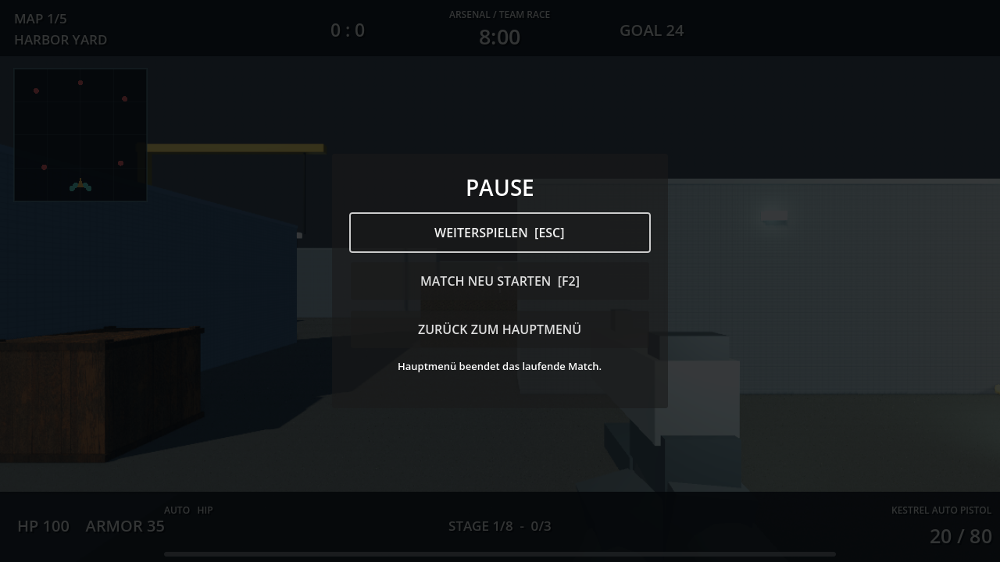
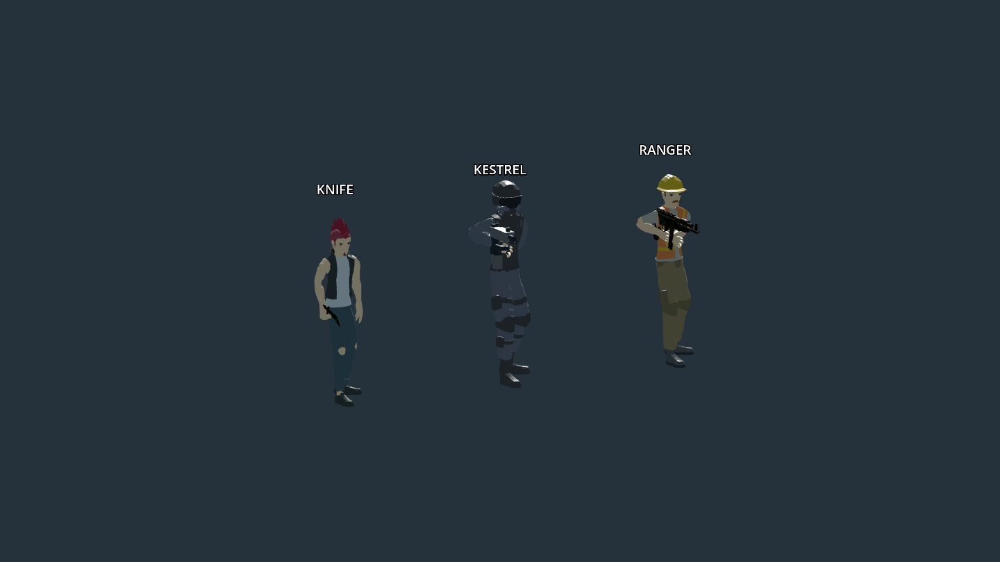

# Menue und Waffenhaltung

## Zurueck ins Hauptmenue

**Escape > Zurueck zum Hauptmenue** beendet das laufende Match. Anschliessend kannst du einen anderen Spielmodus oder eine andere Karte starten. Im Pausenmenue gibt es auch Buttons fuer **Weiterspielen** und **Match neu starten**.

Spieler, Bots und Physikobjekte halten waehrend der Pause an. Der Mauszeiger wird fuer die Buttons freigegeben. Beim Verlassen werden Bots, Respawns, Sandbox-Werkzeuge und die LAN-Verbindung entfernt. Beim Fortsetzen sind Maussteuerung und Sandbox-Werkzeuge wieder verfuegbar.

## Korrigierte Waffenhaltung

- Importierte Schusswaffen zeigen jetzt entlang der Schussrichtung. Messer und Aexte sind ebenfalls ausgerichtet; das Messer hat eine passendere Groesse.
- Die Egoansicht setzt die Waffe an den Griff. Beide Haende und Unterarme folgen den Griffpunkten; Muendungsfeuer sitzt am Lauf.
- Bot-Waffen sind am rechten Handknochen befestigt und folgen den Animationen. Bei Schusswaffen bringt eine Armkorrektur beide Haende an Griff und Stuetzpunkt. Nahkampf behaelt die Schlaganimationen.
- LAN-Spieler verwenden ebenfalls das animierte Charaktermodell und zeigen die tatsaechlich ausgewaehlte Waffe, statt eines unveraenderten Platzhalters.

## Geprueft

Alle fuenf Testsuiten in `RUN_TESTS.cmd` bestanden. Der neue Menue- und Haltungstest prueft unter anderem Mausklicks auf die Pausenbuttons, eingefrorene Spieler und Bots, Moduswechsel, LAN-Abmeldung, die Achsen aller 15 Schusswaffen sowie Griffpunkte beim Stehen, Gehen, Laufen, Schiessen und Nahkampf. Die Mausrueckkehr ins Spiel wurde zusaetzlich in einem nativen Godot-Fenster getestet.

Pausenmenue und Egoansicht wurden bei 1280 x 720 gerendert und angesehen, Bot- und LAN-Modelle zusaetzlich in einer separaten Kontrollansicht. Das Projekt verwendet weiterhin stilisierte Modelle; keine neuen fotorealistischen Waffen- oder Bewegungsassets wurden hinzugefuegt.
