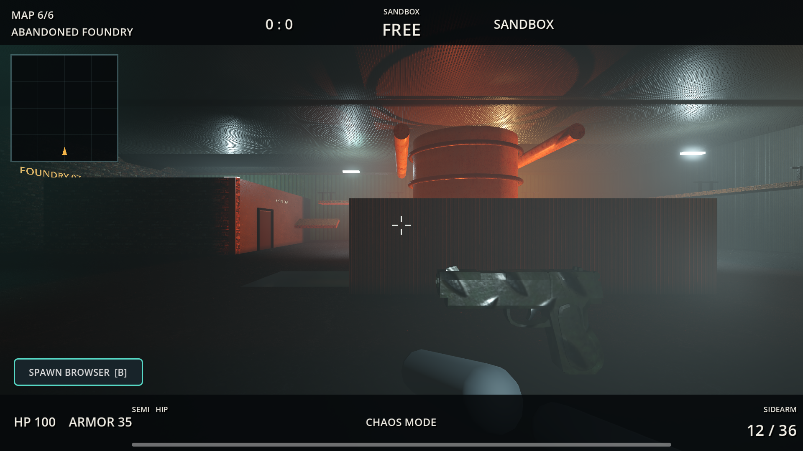
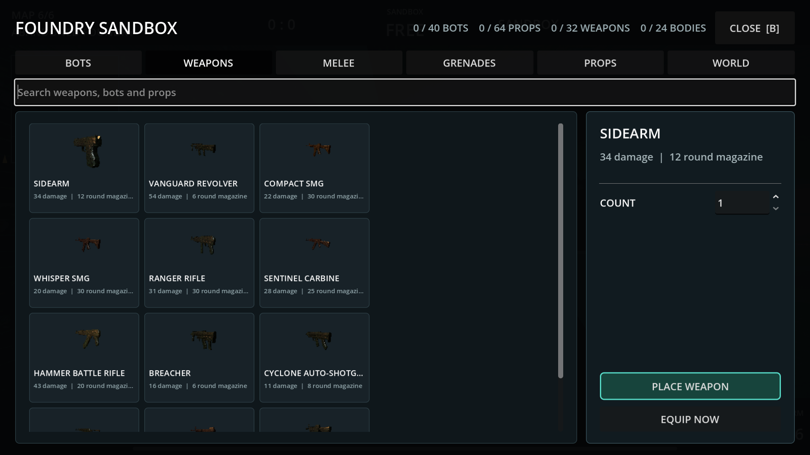

# Local Strike Godot

Ein eigenstaendiger taktischer Shooter und lokaler Physik-Sandbox-Modus fuer Godot 4.7. Sandbox startet standardmaessig in der neuen Karte **Abandoned Foundry**; Defusal, Team Deathmatch, Solo-Bots und LAN bleiben spielbar. Das Projekt verwendet keine Counter-Strike- oder Paint-the-Town-Red-Assets.

## Start

1. `START_GAME.cmd` startet Forward+ mit Vulkan und faellt bei einem Startfehler automatisch auf OpenGL zurueck.
2. `START_GAME_COMPATIBILITY.cmd` erzwingt den reduzierten OpenGL-Modus.
3. `OPEN_EDITOR.cmd` oeffnet das Projekt in Godot 4.7.
4. `RUN_TESTS.cmd` startet Gameplay-, Sandbox-Grenz-, LAN-Socket- und ENet-RPC-Synchronisationstests.

Godot kann ueber `PATH` gefunden oder portabel in `engine/` abgelegt werden. Die EXE selbst ist wegen GitHubs 100-MB-Dateigrenze nicht im Repository; Details stehen in `engine/README.md`.

## Foundry Sandbox

Abandoned Foundry ist eine eigene Szene mit Haupthalle, Schmelzofen, Werkstatt, Kontrollraum, Ladezone, Wartungswegen und begehbaren Laufstegen. Sie nutzt zwoelf lokale PBR-Materialsets, statische Kollision, Occluder, Navigation, Reflexionsproben, volumetrisches Licht und einen OpenGL-Fallback.

Der sichtbare Button unten links oder `B` oeffnet den Spawn-Browser. Die sechs Tabs `Bots`, `Weapons`, `Melee`, `Grenades`, `Props` und `World` besitzen Suche, echte 3D-Vorschauen und eine Schnellleiste fuer zuletzt verwendete Objekte.

- Bots: Team, Scout/Assault/Heavy, beliebige Bot-Waffe, Aggressiv/Wache/Passiv und Formation von 1 bis 10
- Waffen: alle 22 Ausruestungsobjekte direkt ausruesten oder als aufhebbare Worldmodels platzieren
- Props: Holzkisten, Metallkisten, Brennstofffaesser und Werkzeugwagen mit echter RigidBody3D-Physik
- Welt: God Mode, Zeitlupe, Explosion, Ziel entfernen, Kategorien leeren und kompletter Reset
- Limits: 40 Bots, 64 eigene Physikprops, 32 liegende Waffen und 24 persistente Koerper

Beim Platzieren zeigt eine komplette, drehbare Vorschau die Formation. Gruen ist gueltig, Rot blockiert. Linksklick bestaetigt, Rechtsklick bricht ab und das Mausrad dreht.

## Waffen und Effekte

- Zwoelf Schusswaffen, sechs Nahkampfwaffen und vier Granaten
- ADS, Feuerwahl, reproduzierbare Rueckstossmuster, Distanzabfall, Ruestungsdurchdringung, bis zu drei Materialdurchdringungen und ein Abpraller
- Messer, Machete, Baseball Bat, Crowbar, Fire Axe und Sledgehammer mit getrennten leichten/schweren Angriffen, Trefferboegen und Impulsen
- Aufhebbare und fallengelassene Waffen behalten Magazin und Blutverfaerbung
- Frag, Rauch, Flash und Brandgranate mit Bounce, Sichtlinien und physikalischen Impulsen
- Gerichtete Blutspritzer, wachsende Lachen, persistente Sandbox-Ragdolls und Qualitaetslimits ohne Zerstueckelung

Zwoelf Feuerwaffen sowie Messer, Machete, Axt und Hammer verwenden lokale Quaternius-CC0-Modelle. Baseball Bat, Crowbar und Granaten besitzen getrennte Godot-native Modelle. Bots verwenden drei riggte Quaternius-Charaktere mit Lauf-, Schuss-, Nahkampf- und Todesanimationen.

## Weitere Modi

- Defusal: Best of 7, Seitenwechsel nach drei Runden, 12 Sekunden Kaufphase, 105 Sekunden Runde und 35 Sekunden Charge-Timer
- Team Deathmatch: acht Minuten oder 40 Kills, freie Ausruestung und Respawn nach drei Sekunden
- Fuenf kompetitive Karten: Harbor Yard, Train Depot, Solar Lab, Old Quarter und Frostline Station
- LAN: ENet auf UDP `27888`, lokale Suche auf UDP `27889`, direkte IP als Fallback

Sandbox bleibt bewusst lokal. LAN-Schaden und Nahkampftreffer in den kompetitiven Modi bleiben host-autoritativ.

## Grafik und Assets

- Forward+ Hoch: 4x MSAA, SSAO, SSIL, Reflexionen, Glow, volumetrischer Nebel und hochwertige Schatten
- Profile Hoch, Mittel und Niedrig; OpenGL reduziert nur kosmetische Effekte und Lichter
- Zwoelf 1K/2K-Poly-Haven-PBR-Sets mit Albedo, OpenGL-Normalmap und ARM/ORM-Daten
- CC0-Waffen und Figuren von Quaternius sowie Kenney-Impact-Sounds
- Alle Quellen, Autoren, URLs und lokalen Pfade stehen in `ASSET_LICENSES.md`

## Steuerung

| Eingabe | Aktion |
| --- | --- |
| `WASD`, Maus | Bewegen und zielen |
| `Leertaste`, `Strg`, `Shift` | Springen, ducken, sprinten |
| Linksklick | Schiessen, werfen oder leichter Nahkampfangriff |
| Rechtsklick | ADS/Zielfernrohr oder schwerer Nahkampfangriff |
| `R`, `V` | Nachladen, Feuerart wechseln |
| `G` | Nahe Waffe aufnehmen oder aktuelle Waffe fallenlassen |
| `1` bis `4` | Primaerwaffe, Sidearm, Nahkampf, Granate |
| `E` | Interagieren, pflanzen oder entschaerfen |
| `B` | Spawn-Browser beziehungsweise Kaufmenue |
| Linksklick / Rechtsklick / Mausrad | Platzieren / abbrechen / Vorschau drehen |
| `Tab`, `Escape`, `F2` | Scoreboard, Pause, Match neu starten |

## Abnahme

`RUN_TESTS.cmd` prueft Parser und Laufzeit, alle 22 Ausruestungen, PBR-Dateien, Browser-Suche und Aktionen, exakte Bot-Konfiguration, Platzierung, Nahkampf, Effekte, 40/64/32-Objektgrenzen, Defusal und Deathmatch. Ein echter ENet-Test prueft zusaetzlich Host/Client-RPCs, 5v5-Bot-Auffuellung, Bot-Replikate und Spieler-Avatare.

Der 120-Sekunden-Benchmark auf einer RTX 3070 erreichte in Abandoned Foundry bei 1920x1080, Profil Hoch, zehn Bots und 13 Physikobjekten durchschnittlich **139,5 FPS**. Das Minimum-Sample lag bei **132 FPS**, keines der 474 Samples unter 55 FPS. Ergebnis: `docs/benchmark-foundry.json`.
