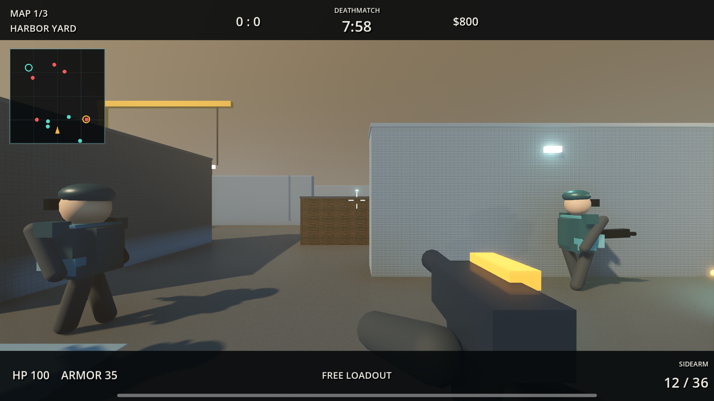

# Local Strike Godot

Ein eigenstaendiger taktischer 5v5-Shooter fuer Godot 4.7. Das Spiel enthaelt Solo-Bots, LAN-Grundfunktionen, Defusal und Team Deathmatch. Es verwendet keine Counter-Strike-Assets oder geschuetzten Namen.

## Start

- Godot 4.7 installieren und das Projekt importieren. Alternativ die portablen Windows-Dateien in `engine/` ablegen.
- `START_GAME.cmd` startet Forward+ mit Vulkan und wechselt bei einem Startfehler automatisch zu OpenGL. Es findet Godot im Projekt oder ueber `PATH`.
- `START_GAME_COMPATIBILITY.cmd` erzwingt den sparsamen OpenGL-Modus.
- `OPEN_EDITOR.cmd` oeffnet das Projekt im Godot-Editor.
- `RUN_TESTS.cmd` prueft Waffen, 5v5-Spawns, Springen, Trefferzonen, Interaktionen, Effektlimits, Deathmatch und LAN-Sockets.

Der portable Editor selbst ist wegen GitHubs 100-MB-Dateigrenze nicht Teil des Repositories. Details stehen in `engine/README.md`.

## Spielmodi

- Defusal: Best of 7, Seitenwechsel nach drei Runden, 12 Sekunden Kaufphase, 105 Sekunden Rundenzeit und 35 Sekunden Charge-Timer.
- Team Deathmatch: acht Minuten oder 40 Kills, freie Ausruestung und Respawns nach drei Sekunden.
- Solo fuellt beide Teams bis 5v5 mit Bots auf.
- LAN verwendet ENet auf UDP-Port `27888`; lokale Server werden ueber UDP-Port `27889` gefunden. Direkte IP ist ebenfalls moeglich.

## Ausstattung

- Sidearm, Compact SMG, Ranger Rifle, Breacher, Marksman und Heavy Sniper
- Messer, Frag- und Rauchgranate
- Kopf-, Torso- und Gliedmassen-Trefferzonen
- Rueckstoss, Bewegungsstreuung, Ruestung, Helm und Waffen-Slots
- Humanoide Scout-, Assault- und Heavy-Bots mit Sicht, Geraeuschsuche, Teamzielen und drei Schwierigkeitsstufen
- Schiebetueren mit Blockierschutz, zerbrechliches Glas, ausschaltbare Lampen und explodierende Brennstoffbehaelter

## Grafik und Audio

- Forward+ mit 4x MSAA, SSAO, SSIL, SSR, Glow, volumetrischem Nebel und 4096er Schatten im Profil Hoch
- Qualitaetsprofile Hoch, Mittel und Niedrig
- Korrekt verwendete CC0-ARM/ORM-PBR-Materialien fuer Beton und Metall sowie prozedurale Normaldetails
- Eigene Geometrie fuer Container, Pfuetzen, Flutlichter, Hafenkran, Gleise, Signale, Zuege, Solarpanels und Laborkern
- Humanoide Figuren mit animierten Armen und Beinen sowie unterschiedliche Viewmodels fuer alle Waffenkategorien
- Oberflaechenspezifische Funken, Staub, Glassplitter, Blutnebel, Tracer, Decals, Explosionen und dichter Rauch
- Raeumliche Kenney-CC0-Schritt-, Metall-, Glas- und Einschlagsounds; Schuesse und Explosionen besitzen einen prozeduralen Fallback

Die CC0-Herkunft ist in `ASSET_LICENSES.md` dokumentiert.

## Steuerung

- `WASD`: bewegen
- Maus: zielen
- Linksklick: schiessen oder Granate werfen
- `Leertaste`: springen
- `Strg`: ducken
- `Shift`: sprinten
- `R`: nachladen
- `1`: Primaerwaffe
- `2`: Sidearm
- `3`: Messer
- `4`: Granate
- `E`: Charge setzen, entschaerfen oder nahe Tuer bedienen
- `B`: Ausruestungsmenue
- `Tab`: Scoreboard
- `Escape` oder `P`: Pause
- `F2`: Match neu starten

## LAN

1. Auf einem Rechner im Hauptmenue `HOST LAN - 5v5` waehlen.
2. Auf weiteren Rechnern `REFRESH LAN` verwenden und den Server doppelklicken.
3. Falls Broadcast durch das Netzwerk blockiert wird, die lokale IPv4-Adresse direkt eingeben.
4. Bei einer Windows-Firewallabfrage den privaten Netzwerken Zugriff auf UDP `27888` und `27889` erlauben.
