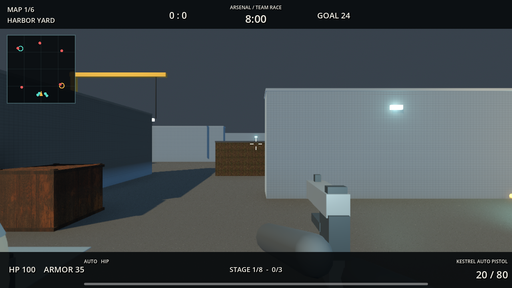

# Local Strike: Arsenal-Update

Start: `START_GAME.cmd`. Im Hauptmenue ist **ARSENAL - TEAM WEAPON RACE** bereits ausgewaehlt. Mit **PLAY SOLO** starten. Die Godot-Engine ist in dieser lokalen Ausgabe enthalten.

## Neuer Spielmodus: Arsenal

- Lokales 5 gegen 5: du und vier verbuendete Bots gegen fuenf Gegner.
- Drei gegnerische Eliminierungen bringen das ganze Team eine Waffenstufe weiter. Beide Teams haben einen eigenen Fortschritt.
- Reihenfolge: Kestrel, Compact SMG, Ranger, Bulwark, Outlaw, Longbow, Vanguard, Combat Knife.
- Sieg nach 24 Eliminierungen; nach acht Minuten entscheidet der Punktestand. Gleichstand ergibt ein Unentschieden.
- Wiedereinstieg nach drei Sekunden mit voller Gesundheit und der aktuellen Teamwaffe.
- Nur die aktuelle Stufenwaffe ist verfuegbar. Kaufmenue, Aufheben und Fallenlassen sind in diesem Modus gesperrt.
- Alle fuenf kompetitiven Karten und drei Bot-Schwierigkeitsgrade sind waehlbar. Arsenal ist vorerst lokal mit Bots spielbar.

## Drei neue Waffen

| Waffe | Rolle | Magazin | Preis in Defusal |
| --- | --- | --- | --- |
| Kestrel Auto Pistol | Schnelle automatische Pistole; mit V auf Einzelfeuer umschaltbar | 20 | $900 |
| Outlaw Double Barrel | Zwei schnelle Schuesse mit jeweils zehn Schrotpellets; stark auf kurze Entfernung, langsames Nachladen | 2 | $1600 |
| Longbow Scout | Leichtes Praezisionsgewehr mit Zielfernrohr; schneller und guenstiger als die Heavy Sniper, geringerer Koerperschaden | 8 | $2200 |

Alle drei verwenden eigene, im Projekt erzeugte 3D-Modelle fuer Egoansicht, Bots, Vorschau und abgelegte Waffen. Sie sind im Kaufmenue, im kostenlosen Deathmatch-Loadout und unter **B > Weapons** in der Sandbox verfuegbar. Damit gibt es 25 Ausruestungsobjekte: 15 Schusswaffen, sechs Nahkampfwaffen und vier Granaten.

## Weitere Korrekturen

- Kaufmenue liest Namen und Preise direkt aus den Waffendaten; zuvor wichen mehrere angezeigte Preise vom Kaufpreis ab.
- Neue Matches entfernen kostenlos erhaltene Waffen aus dem vorherigen Modus.
- Neustart setzt Matchende, Timer und ausstehende Respawns zurueck.
- Matchende stoppt Bots und schuetzt den Spieler vor weiterem Schaden.
- Arsenal zeigt Teamfortschritt und Respawn-Countdown; Bombenziele erscheinen nur im Defusal-Radar.

## Pruefung

`RUN_TESTS.cmd` fuehrt die bisherigen Gameplay- und Sandbox-Tests, den neuen Arsenal-Test sowie beide LAN-Tests aus. Alle vier Testsuiten bestanden am 06.09.2026. Der Arsenal-Test prueft den kompletten Stufendurchlauf bis zum Sieg, beide Teams, Respawns, Zeitlimit, Neustart, Moduswechsel sowie Schiessen, Nachladen, Kauf, Ablegen und Aufheben der neuen Waffen.

Menue und Sandbox-Browser wurden bei 1280 x 720 mit OpenGL gerendert und geprueft; Arsenal-Gameplay zusaetzlich mit Vulkan/Forward+. Die Durchlaeufe melden eine Windows-Zertifikatsspeicherwarnung in der Testumgebung. Diese verhindert weder die lokalen Tests noch die LAN-Verbindung. Ein neuer Leistungstest oder eine laengere manuelle Balance-Runde wurde nicht durchgefuehrt; die alten Foundry-Benchmarkwerte gelten fuer die vorherige Version.
